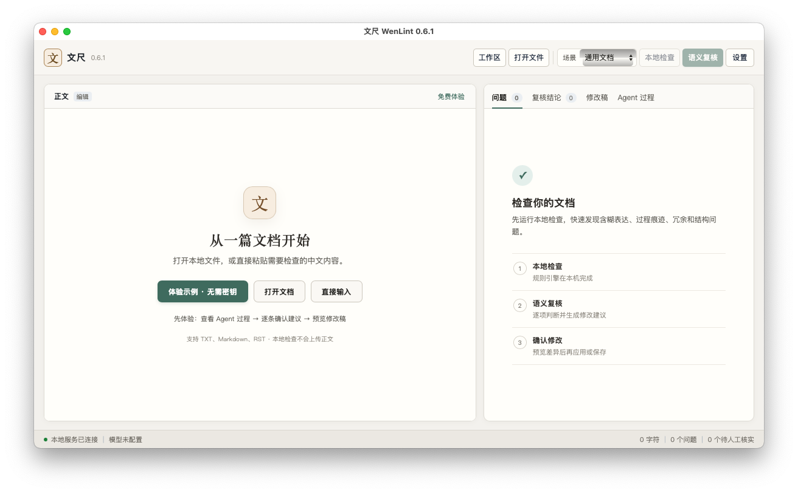

# 最终桌面复测：2026-09-09

> 后续发现并修复了连接超时与 ASK 闭环问题。参见 [0.6.2 补充验收](DESKTOP_062_REVIEW.md)。本文保留为之前版本的历史记录。

用户在两次测试之后明确回复“ok”，允许恢复桌面操作，并将原先三份虚构材料再发送到 DeepSeek，追加一次真实审查。本轮只使用该一次机会，没有额外模型请求测试。执行者是主 agent；此前独立首次使用者记录见 [FIRST_USER_REVIEW.md](FIRST_USER_REVIEW.md)，不把本次主 agent 复核冒称为独立体验。

## 环境与真实结果

- 本地已构建的 `dist-0.6.0-final/WenLint/WenLint.exe`，代码对应 `28d6fc4`；默认窗口截图1189×695，工作区与正文操作完整可见。
- 服务 `https://api.deepseek.com`，模型 `deepseek-v4-flash`，密钥只输入隐藏字段并保留在进程内存中。
- 打开 `demo/workspace/review-me.md`，267字符、通用文档场景、16条静态候选。工作区仅含此前授权的3份材料。
- 点击确认到首次截图观察为835ms，此时已显示“审查进行中”、两条并发请求和取消按钮。这是观察上界，不是精确首帧时延。
- 1.3s列目录，2.3s读取 `evidence/product-baseline.md` 和 `evidence/acceptance-results.txt`。在UI实际展开两份工具结果，均为 `ok:true`、`truncated:false`，对应11行和7行内容；此次没有只重读原稿。
- static在5.8s完成；semantic在24.5s出现JSON格式错误（第1行第5列，5713字符），进行一次格式修复，27.8s完成；过程面板28.0s、40步骤，结论页5次模型调用。
- 结果指出Windows 10与基线Windows 11 23H2矛盾、P95实测1.82秒与“可能”不一致、编号1→3跳号、讨论历史、确定发布日期及验证时态问题。

## 修改控制与文件级验证

修改页6条改写初始全部待确认。C001只删除“总而言之，”，显示原行7、删除符号和字词删除线；顶部采纳按钮可见。执行采纳→撤销→重新采纳，计数和导出按钮状态正确；对C002保留原文，最终1已采纳、4待确认、1保留。全文核对的固定操作栏可见。

原生另存为创建 [native-live-final-export.md](../../demo/evidence/native-live-final-export.md)。独立读取文件逐字节验证：导出严格等于原文只删除一次“总而言之，”，原文件与Git版本一致；源文件与导出均无CRLF，17个LF保持不变。导出SHA-256为 `02c98548a18b79f0f26fac7228bf10de4301c47877419f345bf046fa73e545fb`。

## 未掩盖的问题及后续修复

1. **候选关联错误**：结论页把Windows平台语义补充附到了H001发布日期问题，把性能补充附到了M002平台问题。语义通道的编号声称被直接用于合并，缺少原文位置核验。最小回归 `pytest tests/test_agent.py -k wrong_adjacent -q` 先失败，明确显示发布日期理由混入平台依据；0.6.1改用扫描器行列和命中文本验证关联，过滤不匹配编号，不能唯一定位时保留独立建议。并显式提供候选编号。修复及相邻模块49项回归通过，不增加在线调用。
2. **引用行号不准**：模型说基线发布日期第5行、平台第6行、超时第7行；实际分别第4、5、6行。引用内容正确，验收记录P95第5行正确，但文字理由中的行号仍为模型生成，尚没有结构化引用校验，不能承诺精确。
3. **质量与稳定性边界**：本轮仍依赖一次JSON格式修复，部分改写如“各环节协同”仍较抽象。28秒属于单次短demo观测，不代表长文、其他服务或稳定平均值。

已验证0.6.0最终布局、参考资料实际读取、用户确认和LF导出；0.6.1关联修复仅有离线回归。长文真实模型性能、Mac图形界面人工体验仍未执行。

## 0.6.1 Mac发行包窗口启动补充验证

[原生Mac窗口验收](https://github.com/DreamStars1/WenLint/actions/runs/34264484963)在macos-15 arm64和macos-15-intel x64上直接下载0.6.1发行ZIP，校验SHA-256后启动包内实际可执行程序，定位唯一的WenLint应用窗口并截图。没有模型调用，没有配置密钥、输入文档或修改系统权限。两种架构均成功。

主agent已查看截图：标题均为文尺WenLint 0.6.1，中文首页完整显示，示例/打开文档/直接输入按钮可见，底部显示本地服务已连接、模型未配置，无空白页或加载错误。Intel窗口1200×700；Apple芯片runner窗口适配为1024×681。此证据验证真实包的窗口启动与首页渲染，仍不等同于Mac全流程人工体验或签名/公证。

