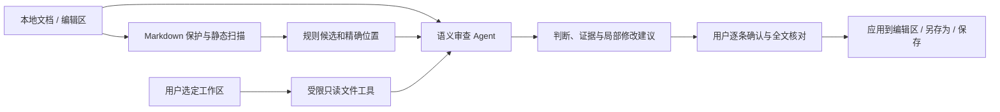

# 文尺 WenLint：可复核的中文文档审查工作台

## 项目背景与应用场景

中文产品文档、报告和论文的审查同时包含可机械定位的问题与必须理解上下文的问题。只靠关键词替换容易误删学术审慎、业务术语和引述；直接让模型全文润色又容易改变事实、难以核对修改范围。

文尺将静态检查、语义裁决、依据查找与逐项确认放进同一桌面工作台。作者可以先免费完成本地扫描，再按需要连接兼容 OpenAI 接口的模型完成深度审查。产品团队可以核对 PRD 的状态和编号，研究人员可以保留有必要的谨慎表达，报告作者可以结合工作区中的事实资料修订陈述。

## 技术架构

核心引擎使用 Python 标准库，负责 Markdown 等长 mask、规则扫描及行列定位。Vue 3 界面通过 pywebview 桥接本地文件、扫描器与 Agent。工作区接口负责路径约束、支持文件类型和读取预算；模型只使用暴露的工具，不能获得任意 shell 权限。

语义判断使用 KEEP / REWRITE / VERIFY / ASK 四分类契约，区分合理用法、可修改问题、待查证问题与需要作者补充的信息。确定性扫描未发现候选，不代表已经审查全文语义。修改稿的保存仍由用户明确触发，覆盖原文件前检查文件摘要，避免覆盖其他程序的新修改。

## 设计创新及可验证的差异

1. **语境优先的静态检查**：规则输出候选和审查提示，而不把“可能”“赋能”等词直接判为错误；Markdown 保护层保留位置，便于核对原文。
2. **依据约束的 Agent**：在用户选择的工作区内查找可获得的资料，保留查证和作者确认分支；资料不足时不虚构事实。当前可用知识主要来自文档和本地工作区，不承诺全网事实核查。
3. **可见且可控的审查流程**：前端展示阶段进度、工具调用及可供用户阅读的审查说明。它们是执行记录与判断摘要，不声称暴露模型内部全部思考。
4. **逐项修改控制**：将审查输出拆为可独立确认的局部修改，用户核对差异后才应用，保留未接受的原文。静态检查、模型等待和保存动作使用各自的状态。
5. **分层响应与成本控制**：优先给出本地检查反馈，模型任务异步运行；模型调用次数、耗时和取消状态可见。性能改进以实测为准，见 [验证记录](VALIDATION.md)。
6. **有界长文与明确差异**：长文按核心段及邻近上下文审查，每批最多两段、12次HTTP请求和120秒，会话累计最多128次请求。全文静态扫描仅一次，语义覆盖单独显示；续查保留用户决定。参考文件分页且可连续读取长行，修改采用带行号和字词强调的GitHub风格diff。

这些是本项目的工程设计及定位，并非对同类产品“首创”或“最优”的证明。真实写作语料的 precision / KEEP 率仍需要更广泛评测。

## 交付与持续发展

代码采用 MIT 协议；CLI 运行时无需第三方 Python 库，桌面端可由 Windows 和 macOS 各自原生构建为包含运行环境的应用。CI 保存归档、SHA-256 和依赖版本清单。源代码、示例文档、自动化验证与构建脚本均在同一仓库。

近期重点是稳定短文、分段长文及多文件资料审查体验，积累脱敏真实文档反馈；后续逐步完善跨段整体一致性评测、可导出报告、规则配置及插件接口。项目维护方式及边界见 [治理与依赖说明](GOVERNANCE.md) 和 [路线图](../../ROADMAP.md)。
